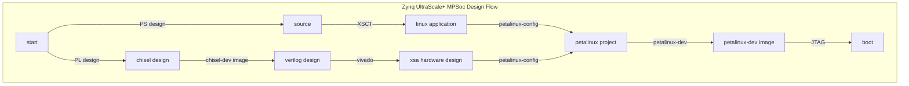

# petalinux-docker-build
Build petalinux docker image

## Before you start

1. Make sure you have already downloaded [petalinux tools](https://www.xilinx.com/support/download/index.html/content/xilinx/en/downloadNav/embedded-design-tools.html). 
2. Place the downloaded `.run` file into `install/` directory

## How to use

- `make image`: build image locally using your downloaded installer
- `make container`: use your built image to create a container

